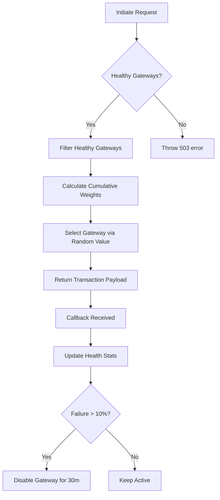

# Payment Gateway Service

A robust, weighted routing and health-monitored payment gateway service built with NestJS. This service intelligently routes transaction requests to various payment providers (Razorpay, PayU, Cashfree) based on configured weights and real-time health metrics.

## 🚀 Features

- **Dynamic Weighted Routing**: Distributes traffic across multiple gateways using configurable weights (e.g., Razorpay: 70%, PayU: 20%, Cashfree: 10%).
- **Automated Health Monitoring**: Monitors gateway success/failure rates and automatically "trips a circuit" to disable unhealthy gateways for a cooldown period.
- **Transaction Management**: Simple endpoints to initiate transactions and process gateway callbacks.
- **Health Statistics**: Real-time insights into gateway performance and status.

## 🛠️ Tech Stack

- **Framework**: [NestJS](https://nestjs.com/) (Node.js)
- **Language**: TypeScript
- **Validation**: Class-validator & Class-transformer
- **Mocking**: In-memory transaction tracking (extendable to Redis/PostgreSQL)

## 🏗️ Architecture

The service consists of three core components:

1.  **Transactions Controller**: Handles HTTP requests for initiating transactions and processing callbacks.
2.  **Routing Service**: Implements the weighted selection logic with health awareness.
3.  **Health Service**: Tracks failure rates over a sliding window (15 mins) and manages gateway availability using a circuit breaker pattern.

### Routing Logic Flow



## 📦 Project Structure

```text
src/
├── app.module.ts            # Main application module
├── main.ts                  # Application entry point
└── payments/
    ├── dto/                 # Data Transfer Objects for validation
    ├── health.service.ts    # Circuit breaker & health tracking logic
    ├── routing.service.ts   # Weighted routing logic
    └── transactions.controller.ts # API endpoints
```

## ⚙️ Installation

1. Clone the repository.
2. Install dependencies:
   ```bash
   npm install
   ```

## 🏃 Running the Service

```bash
# development
npm run start

# watch mode
npm run start:dev

# production mode
npm run start:prod
```

## 🔌 API Endpoints

### 1. Initiate Transaction
`POST /transactions/initiate`

**Request Body:**
```json
{
  "order_id": "ORDER_101",
  "amount": 1500.00,
  "currency": "INR",
  "customer_email": "test@example.com"
}
```

**Response:**
```json
{
  "order_id": "ORDER_101",
  "amount": 1500.00,
  "currency": "INR",
  "customer_email": "test@example.com",
  "transaction_id": "TXN_1735189200000",
  "gateway": "razorpay",
  "status": "pending"
}
```

### 2. Payment Callback
`POST /transactions/callback`

**Request Body:**
```json
{
  "order_id": "ORDER_101",
  "gateway": "razorpay",
  "status": "success" 
}
```

### 3. Health Stats
`GET /transactions/health-stats`

Returns current failure rates and circuit breaker status for all providers.

## 🛡️ Circuit Breaker Configuration

The `HealthService` uses the following defaults:
- **Failure Threshold**: 10% failure rate triggers a cooldown.
- **Minimum Sample**: At least 5 transactions must occur before triggering.
- **Monitoring Window**: 15 minutes sliding window for failures.
- **Cooldown Period**: 30 minutes of downtime before a gateway is retried.

---

Built for **PlatinumRx** to ensure 99.9% payment reliability.
